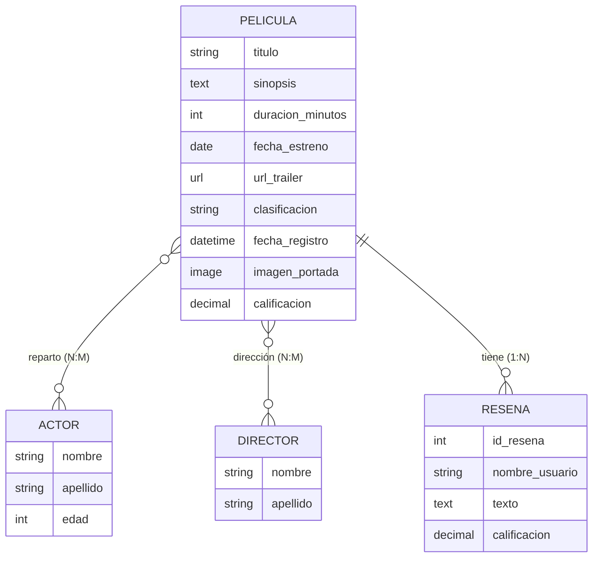

# MovieCali

**Catálogo web de películas con reseñas de usuarios, desarrollado con Python y Django.**

MovieCali es una aplicación web para gestionar un catálogo de películas y las entidades que lo componen: actores, directores y reseñas. Permite registrar películas, consultar la ficha completa de cada título y publicar opiniones, garantizando la consistencia de los datos mediante restricciones a nivel de modelo y de base de datos.

El proyecto fue desarrollado como **Trabajo Integrador** y aplica de forma progresiva los contenidos centrales de Django: la arquitectura **MVT (Model-View-Template)**, el sistema de rutas, el motor de plantillas (DTL), el ORM, las migraciones y el procesamiento de formularios.

---

## Tabla de contenidos

1. [Características principales](#-características-principales)
2. [Tecnologías](#-tecnologías)
3. [Arquitectura](#-arquitectura)
4. [Estructura del proyecto](#-estructura-del-proyecto)
5. [Modelo de datos](#-modelo-de-datos)
6. [Reglas de negocio, validaciones y restricciones](#-reglas-de-negocio-validaciones-y-restricciones)
7. [Rutas y navegación](#-rutas-y-navegación)
8. [Ciclo de vida de una solicitud](#-ciclo-de-vida-de-una-solicitud)
9. [Sistema de templates](#-sistema-de-templates)
10. [Consultas con el ORM](#-consultas-con-el-orm)
11. [Migraciones](#-migraciones)
12. [Instalación y ejecución](#-instalación-y-ejecución)
13. [Decisiones de diseño](#-decisiones-de-diseño)
14. [Estado del proyecto y próximos pasos](#-estado-del-proyecto-y-próximos-pasos)
15. [Contexto académico](#-contexto-académico)
16. [Equipo y licencia](#-equipo-y-licencia)

---

## Características principales

- **Catálogo de películas:** la página de inicio lista los títulos disponibles, con su póster y un acceso directo a las reseñas de cada uno.
- **Alta de películas:** formulario de carga con procesamiento `GET`/`POST` y redirección a la ficha del registro creado.
- **Ficha de película:** página propia por título (ruta dinámica) con sinopsis, duración, fecha de estreno, clasificación, calificación, póster, tráiler, reparto y dirección.
- **Reseñas de usuarios:** cada película admite múltiples reseñas; se pueden consultar y publicar nuevas opiniones desde una misma pantalla, con validación de los datos y mensajes de error.
- **Integridad de datos:** reglas de negocio protegidas con `CheckConstraint`, `UniqueConstraint`, validadores de campo y validaciones personalizadas en `clean()`.
- **Relaciones complejas:** relaciones muchos a muchos (películas–actores, películas–directores) y uno a muchos (películas–reseñas), con comportamiento de eliminación definido para cada caso.
- **Interfaz reutilizable:** herencia de plantillas con una base común y componentes compartidos (navegación y pie de página).

---

## Tecnologías

| Componente | Detalle |
|---|---|
| Lenguaje | Python 3.12 o superior |
| Framework | Django 6.1 |
| Acceso a datos | Django ORM + sistema de migraciones |
| Base de datos | Relacional (SQLite por defecto en desarrollo) |
| Manejo de imágenes | Pillow 12.3.0 |
| Frontend | HTML5, CSS y Django Template Language (DTL) |

---

## Arquitectura

MovieCali sigue el patrón **MVT (Model-View-Template)** de Django, con una separación clara entre la lógica de datos, el procesamiento de solicitudes y la presentación.

### Models

Definen las entidades del dominio, sus atributos, sus relaciones y sus reglas de integridad.

| Entidad | Responsabilidad |
|---|---|
| `Pelicula` | Información técnica, descriptiva, de clasificación y de referencia audiovisual de cada título. |
| `Actor` | Actores que pueden participar en una o más películas. |
| `Director` | Directores que pueden dirigir una o más películas. |
| `Resena` | Opinión de un usuario sobre una película puntual: texto, calificación y autoría. |

### Views

Reciben la solicitud HTTP, consultan o modifican los modelos mediante el ORM y construyen el **contexto** que se envía al template.

| Vista | Ubicación | Métodos | Función |
|---|---|---|---|
| `inicio` | `proyecto_MC/views.py` | GET | Página principal del sitio: listado del catálogo. |
| `agregar_pelicula` | `peliculas/views.py` | GET, POST | Muestra el formulario de alta y procesa los datos enviados. |
| `detalle_pelicula` | `peliculas/views.py` | GET | Ficha completa de una película (recibe `id`). |
| `detalle_resenas_pelicula` | `peliculas/views.py` | GET, POST | Lista las reseñas de una película y permite publicar nuevas (recibe `id`). |

> La vista `inicio` vive en el proyecto (y no en la app `peliculas`) porque representa la página raíz de todo el sitio y no una acción específica del catálogo.

### Templates

La interfaz se construye con HTML y DTL, utilizando una plantilla base y componentes reutilizables.

---

## Estructura del proyecto

```text
MovieCali/
├── manage.py
├── requirements.txt
│
├── proyecto_MC/                    # Configuración del proyecto
├── templates/
    │   └── inicio.html
│   ├── settings.py
│   ├── urls.py                     # URLconf principal (raíz + include de la app)
│   ├── views.py                    # Vista inicio
│   └── ...
│
└── peliculas/                      # Aplicación principal
    ├── migrations/
    │   └── 0001_initial.py
    ├── static/
    │   └── peliculas/
    │       └── css/                # body, header, footer, inicio, agregar, detalles
    ├── templates/
    │   ├── base.html               # Plantilla base
    │   ├── componentes/
    │   │   ├── navegacion.html
    │   │   └── footer.html
    │   └── peliculas/
    │       ├── agregar.html
    │       ├── detalle.html
    │       └── resenas_usuarios.html
    ├── models.py                   # Pelicula, Actor, Director, Resena
    ├── views.py
    ├── urls.py                     # app_name = "peliculas"
    └── ...
```

---

## Modelo de datos

### Diagrama de relaciones



### `Pelicula`

| Campo | Tipo | Obligatorio | Descripción |
|---|---|:---:|---|
| `id` | `BigAutoField` | Automático | Clave primaria. |
| `titulo` | `CharField(max_length=150)` | Sí | Título de la película. |
| `sinopsis` | `TextField` | Sí | Resumen del argumento. |
| `duracion_minutos` | `PositiveIntegerField` | Sí | Duración en minutos (debe ser mayor a 0). |
| `fecha_estreno` | `DateField` | Sí | Fecha de estreno (solo fecha, sin hora). |
| `url_trailer` | `URLField` | No | Enlace al tráiler; valida el formato de URL. |
| `clasificacion` | `CharField(max_length=5, choices)` | Sí | `ATP`, `M13`, `M16` o `M18`. Valor por defecto: `ATP`. |
| `fecha_registro` | `DateTimeField(auto_now_add=True)` | Automático | Fecha y hora de carga en el sistema. |
| `imagen_portada` | `ImageField(upload_to="peliculas/posters/")` | Sí | Póster; admite `jpg`, `jpeg`, `png` y `webp`. |
| `calificacion` | `DecimalField(max_digits=3, decimal_places=1)` | Sí | Escala de 0.1 a 10.0. Valor por defecto: `0.1`. |
| `actores` | `ManyToManyField(Actor, related_name="peliculas")` | — | Reparto. |
| `directores` | `ManyToManyField(Director, related_name="peliculas")` | — | Dirección (admite codirección). |

Orden por defecto: `-fecha_estreno`, `titulo`. Representación textual: `Título (año)`.

### `Actor` y `Director`

| Campo | Tipo | Obligatorio | Descripción |
|---|---|:---:|---|
| `id` | `BigAutoField` | Automático | Clave primaria. |
| `nombre` | `CharField(max_length=100)` | Sí | Nombre de pila. |
| `apellido` | `CharField(max_length=100)` | Sí | Apellido. |
| `edad` | `PositiveIntegerField(null=True, blank=True)` | No | Solo en `Actor`; campo opcional. |

Ambos modelos definen una restricción de unicidad sobre la combinación `nombre` + `apellido`.

### `Resena`

| Campo | Tipo | Obligatorio | Descripción |
|---|---|:---:|---|
| `id_resena` | `AutoField` | Automático | Clave primaria (identidad propia, ya que muchas reseñas comparten película). |
| `pelicula` | `ForeignKey(Pelicula, on_delete=CASCADE, related_name="resenas")` | Sí | Película reseñada. |
| `nombre_usuario` | `CharField(max_length=100)` | Sí | Autor de la reseña (no se admiten reseñas anónimas). |
| `texto` | `TextField` | Sí | Contenido; entre 2 y 15.000 palabras. |
| `calificacion` | `DecimalField(max_digits=3, decimal_places=1)` | Sí | Puntaje otorgado a la película. |

### Relaciones y comportamiento ante eliminaciones

| Relación | Tipo Django | Ubicación | Cardinalidad | Nombre inverso |
|---|---|---|---|---|
| Película – Actor | `ManyToManyField` | `Pelicula` | N:M | `actor.peliculas` |
| Película – Director | `ManyToManyField` | `Pelicula` | N:M | `director.peliculas` |
| Película – Reseña | `ForeignKey` | `Resena` | 1:N | `pelicula.resenas` |

| Se elimina… | Comportamiento |
|---|---|
| **Película** | Se eliminan sus reseñas (`CASCADE`). Se desvinculan sus actores y directores, pero estos **no** se eliminan, ya que pueden participar en otras películas. |
| **Actor** | Se **impide** si es el único actor de alguna película. En caso contrario se elimina y se desvincula de sus películas. |
| **Director** | Se **impide** si es el único director de alguna película. En caso contrario se elimina y se desvincula de sus películas. |
| **Reseña** | Solo se elimina la reseña; la película no se ve afectada. |

Los vínculos entre entidades no poseen atributos propios, por lo que no se requieren tablas intermedias explícitas.

---

## Reglas de negocio, validaciones y restricciones

Las reglas se implementan en capas para que la integridad se cumpla **sin importar por dónde ingresen los datos** (formulario, panel de administración, consola o API).

### Película

| Regla | Mecanismo |
|---|---|
| El título y la sinopsis son obligatorios (no vacíos). | `blank=False` + `CheckConstraint` (`pelicula_titulo_no_vacio`, `pelicula_sinopsis_no_vacia`) |
| La duración debe ser mayor a 0. | `CheckConstraint` (`pelicula_duracion_positiva`) |
| La fecha de estreno no puede ser anterior al 01/01/1888. | `CheckConstraint` (`pelicula_fecha_estreno_valida`) |
| La fecha de estreno no puede ser futura. | Validación en `clean()` comparando con `timezone.now().date()` |
| La calificación debe estar entre 0.1 y 10. | `CheckConstraint` (`pelicula_calificacion_en_rango`) |
| No pueden existir dos películas con el mismo título y fecha de estreno. | `UniqueConstraint` (`pelicula_unica_por_titulo_y_fecha`) |
| El póster solo admite formatos de imagen válidos. | `FileExtensionValidator(["jpg", "jpeg", "png", "webp"])` |
| Toda película debe tener al menos un actor y un director. | Protección en el borrado de `Actor` y `Director` |

### Actor y Director

| Regla | Mecanismo |
|---|---|
| No se puede registrar dos veces la misma combinación nombre + apellido. | `UniqueConstraint` (`actor_unico`, `director_unico`) |
| No se puede eliminar a quien sea el único actor/director de una película. | Sobrescritura de `delete()` que lanza `ValidationError` |

### Reseña

| Regla | Mecanismo |
|---|---|
| Toda reseña pertenece a una película. | `ForeignKey` con `null=False` |
| Toda reseña tiene un usuario asignado (sin anonimato). | `nombre_usuario` obligatorio (`blank=False`) |
| Un usuario solo puede reseñar una vez cada película. | `UniqueConstraint` sobre (película, nombre de usuario) |
| La calificación debe estar dentro del rango válido. | `CheckConstraint` (`resena_calificacion_en_rango`) |
| El texto debe tener entre 2 y 15.000 palabras. | Validación en `clean()` con `len(texto.split())` |

> **Nota técnica:** Django no ejecuta `clean()` automáticamente al llamar a `save()`. Por eso las vistas invocan `full_clean()` antes de guardar, capturan `ValidationError` y devuelven los errores al template. Del mismo modo, la sobrescritura de `delete()` se aplica al borrado de instancias individuales; los borrados masivos mediante `QuerySet.delete()` no la invocan.

### Casos límite contemplados

El diseño fue revisado con ejemplos concretos, entre ellos:

| Caso | Resultado esperado |
|---|---|
| Película válida (120 min, calificación 8.5, fecha válida) | ✅ Se guarda |
| Título vacío | ❌ Se rechaza |
| Duración `0` o negativa (`-50`) | ❌ Se rechaza |
| Calificación `0.1` (mínimo) | ✅ Se permite |
| Calificación `10.1` | ❌ Se rechaza |
| Estreno el `01/01/1888` (límite) | ✅ Se permite |
| Estreno el `31/12/1887` | ❌ Se rechaza |
| Estreno en fecha futura | ❌ Se rechaza |
| Mismo título y misma fecha de estreno | ❌ Se rechaza (unicidad) |
| Mismo título, distinta fecha de estreno | ✅ Se permite |
| Reseña sin película o sin usuario | ❌ Se rechaza |
| Segunda reseña del mismo usuario sobre la misma película | ❌ Se rechaza |
| Reseña de una sola palabra / de más de 15.000 palabras | ❌ Se rechaza |
| Actor con igual nombre y distinto apellido | ✅ Se permite |
| Eliminar al único actor de una película | ❌ Se impide |
| Eliminar un actor que comparte película con otros | ✅ Se permite |
| Mismo actor repetido en una misma película | ❌ Se rechaza (la relación es única por par) |

---

## 🔄 Ciclo de vida de una solicitud

El flujo general respeta la estructura habitual de Django:

```text
Request → URLconf → View → Model / ORM → Context → Template → Response
```

### Consulta de solo lectura (`GET /peliculas/3/`)

```text
GET /peliculas/3/
        ↓
proyecto_MC/urls.py  →  include("peliculas.urls")
        ↓
peliculas/urls.py    →  "<int:id>/"  (id=3)
        ↓
detalle_pelicula(request, id=3)
        ↓
Consulta de la película
        ↓
Contexto  →  {"titulo_pagina": ..., "pelicula": ..., "reparto": [...]}
        ↓
detalle.html
        ↓
Respuesta HTML
```

### Procesamiento de formularios: patrón Post/Redirect/Get

Toda vista que **procesa un formulario** termina en `redirect()`; toda vista que **solo muestra información** termina en `render()`. De este modo, tras un `POST` exitoso el navegador realiza un nuevo `GET`, lo que evita reenvíos accidentales del formulario al recargar la página.

```text
POST /peliculas/agregar/
        ↓
agregar_pelicula(request)      método == POST
   ├─ lee los datos con request.POST.get(...)
   └─ crea y guarda la película
        ↓
redirect("peliculas:detalle", id=<id>)     ← no hay render()
        ↓
302 Found → el navegador solicita:  GET /peliculas/<id>/
```

| Funcionalidad | Método | ¿Pasa por `include()`? | Respuesta |
|---|---|:---:|---|
| Inicio | GET | No (URLconf principal) | `render()` |
| Agregar (mostrar formulario) | GET | Sí | `render()` |
| Agregar (guardar) | POST | Sí | `redirect()` → GET a Detalle |
| Detalle | GET | Sí | `render()` |
| Reseñas (mostrar) | GET | Sí | `render()` |
| Reseñas (publicar) | POST | Sí | `redirect()` → GET a Reseñas |

En las reseñas, si la validación falla (por ejemplo, texto demasiado corto o reseña duplicada), la vista **no redirige**: vuelve a renderizar el mismo template incluyendo `errores` en el contexto para informar al usuario.

Todos los formularios `POST` incluyen `` como protección contra la falsificación de solicitudes entre sitios (CSRF).

---

## Sistema de templates

### Herencia y componentes

- **`base.html`** define la estructura común (cabecera, `<main>`, pie de página) y los bloques `title`, `extra_css`, `navegacion` y `content`.
- Las páginas hijas usan `` y completan únicamente los bloques que necesitan.
- **Componentes reutilizables** con ``: `componentes/navegacion.html` (se agrega solo en las páginas que lo usan; el inicio no lo necesita) y `componentes/footer.html` (presente en todas las páginas desde la base).
- Cada página carga su propia hoja de estilos mediante el bloque `extra_css` y ``.

> **Buena práctica:** si una variable usada en el template no coincide exactamente con una clave del contexto, Django no lanza error: simplemente la renderiza vacía. Por eso conviene verificar manualmente la correspondencia entre los nombres del contexto y los del template.

---

## Consultas con el ORM

La aplicación trabaja con los modelos y sus relaciones sin escribir SQL manualmente.

```python
# Todas las películas registradas
Pelicula.objects.all()

# Películas con calificación mayor o igual a 8
Pelicula.objects.filter(calificacion__gte=8)

# Obtener una película o responder 404 si no existe
pelicula = get_object_or_404(Pelicula, id=id)

# Actores y directores de una película
pelicula.actores.all()
pelicula.directores.all()

# Reseñas de una película, de la más reciente a la más antigua
pelicula.resenas.order_by("-id_resena")

# Acceso inverso: películas de un actor o de un director
actor.peliculas.all()
director.peliculas.all()
```

---

## Migraciones

Los cambios en los modelos se gestionan con el sistema de migraciones de Django, que mantiene sincronizada la estructura de la base de datos con la definición actual de los modelos.

```bash
python manage.py makemigrations   # genera migraciones a partir de los cambios en models.py
python manage.py migrate          # aplica las migraciones a la base de datos
python manage.py showmigrations   # muestra el estado de cada migración
```

La migración inicial (`0001_initial.py`) crea las cuatro entidades, las relaciones muchos a muchos y todas las restricciones (`CheckConstraint` y `UniqueConstraint`) descritas en este documento.

---

## Instalación y ejecución

### Requisitos previos

- Python 3.12 o superior
- `pip` y `venv`
- Git

### Dependencias

Las versiones están fijadas en `requirements.txt`:

```text
asgiref==3.12.1
Django==6.1
pillow==12.3.0
sqlparse==0.6.0
tzdata==2026.4
```

### Pasos

**1. Clonar el repositorio e ingresar al proyecto**

```bash
git clone <URL_DEL_REPOSITORIO>
cd MovieCali
```

**2. Crear y activar el entorno virtual**

```bash
python -m venv .venv
```

```bash
# Windows
.venv\Scripts\activate

# Linux / macOS
source .venv/bin/activate
```

**3. Instalar las dependencias**

```bash
pip install -r requirements.txt
```

**4. Aplicar las migraciones**

```bash
python manage.py migrate
```

**5. (Opcional) Crear un superusuario para el panel de administración**

```bash
python manage.py createsuperuser
```

**6. Iniciar el servidor de desarrollo**

```bash
python manage.py runserver
```

La aplicación estará disponible en **http://127.0.0.1:8000/**
---

## Estado del proyecto y próximos pasos

| Área | Estado |
|---|---|
| Modelos, relaciones y restricciones | ✅ Implementado |
| Migración inicial | ✅ Generada |
| Reseñas con ORM, `full_clean()` y manejo de errores | ✅ Implementado |
| Herencia de plantillas y componentes | ✅ Implementado |
| Inicio, alta y detalle de película conectados al ORM | 🔄 En transición (etapas previas trabajaron con una lista en memoria) |


## MovieCali fue desarrollado como proyecto de aplicación de los contenidos de Django. Durante su desarrollo se trabajó progresivamente sobre:

- organización de URLs y rutas dinámicas;
- vistas y respuestas HTTP (`render` y `redirect`);
- sistema de templates y Django Template Language;
- modelos y tipos de campos;
- relaciones entre entidades;
- ORM y consultas sobre los datos;
- migraciones;
- validaciones y restricciones de integridad;
- formularios y procesamiento de solicitudes GET y POST.

El resultado es una aplicación web estructurada bajo MVT, con una separación clara entre la lógica de datos, el procesamiento de las solicitudes y la presentación de la información.

---

## Equipo y licencia

**Integrantes:** Eliana Salvo, Diego Ponce, Brenda Pavez

**Institución / Cátedra:** Universidad del Chubut - Programacion Web 2

**Licencia:** _<Uso académico>_
